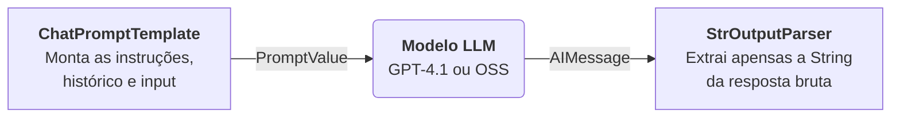

# Questão 2 — Chatbot Tutor de Python (LangChain + GPT-4)

Chatbot de linha de comando que atua como **tutor especialista em Python**, utilizando **LangChain** com **LCEL** (LangChain Expression Language), modelo **GPT-4** da OpenAI, e **histórico de conversação** para manter contexto entre perguntas.

---

## 🛠️ Tecnologias

| Tecnologia | Finalidade |
|---|---|
| **Python 3.10+** | Linguagem principal |
| **LangChain** | Framework de orquestração para LLMs |
| **LangChain LCEL** | Composição declarativa da cadeia (pipe `\|`) |
| **GitHub Models (GPT-4.1)** | Modelo de linguagem principal |
| **HuggingFace** | Modelo alternativo open-source (flag `--oss`) |
| **python-dotenv** | Carregamento seguro de chaves de API |

---

## 📁 Estrutura do Projeto

```
questao-2-chatbot/
├── chatbot.py           # Script principal (LCEL + CLI + histórico)
├── .env.example         # Template das variáveis de ambiente
├── .gitignore
├── requirements.txt
└── README.md
```

---

## 🚀 Como Executar

### 1. Acessar o diretório

```bash
cd questao-2-chatbot
```

### 2. Criar e ativar o ambiente virtual

```bash
# Criar
python -m venv venv

# Ativar (Windows)
.\venv\Scripts\activate

# Ativar (Linux/macOS)
source venv/bin/activate
```

### 3. Instalar dependências

```bash
pip install -r requirements.txt
```

### 4. Configurar chave de API

```bash
# Copie o template
cp .env.example .env

# Edite o .env com sua chave. 
# Para modo padrão (GitHub Models ou OpenAI):
LLM_API_KEY=sua-chave-real

# 💡 Para obter a chave do GitHub Models:
# 1. Visite: https://github.com/marketplace/models/azure-openai/gpt-4-1/playground
# 2. Clique em "Use this model" no canto superior direito
# 3. Selecione "Create Personal Token" pelo GitHub
# 4. Copie o token (começa com ghp_ ou github_pat_) e coloque em LLM_API_KEY

# Para modo OSS (HuggingFace):
HUGGINGFACEHUB_API_TOKEN=hf-sua-chave-real
```


### 5. Iniciar o chatbot

```bash
# Modo padrão (GitHub Models / OpenAI - GPT-4.1)
python chatbot.py

# Modo open-source (HuggingFace)
python chatbot.py --oss
```

---

## 💬 Uso

```
============================================================
🐍  Chatbot Tutor de Python
    Modelo: GitHub Models (GPT-4.1)
============================================================
Faça suas perguntas sobre Python!
Digite 'sair' ou 'exit' para encerrar.

Você: O que são list comprehensions?

🤖 Tutor: List comprehensions são uma forma concisa de criar listas
   em Python...

Você: Me dê um exemplo com filtro

🤖 Tutor: Claro! Baseado na sua pergunta anterior sobre list
   comprehensions, aqui está um exemplo com filtro...

Você: sair
👋 Até mais! Bons estudos em Python!
```

O bot mantém **contexto entre mensagens** — na segunda pergunta, ele já sabe que estamos falando de list comprehensions.

---

## 🏗️ Arquitetura LCEL (LangChain Expression Language)

O LCEL é uma sintaxe declarativa para compor pipelines de processamento preditivo, inspirada no operador _pipe_ (`|`) dos sistemas Unix. Ele resolve o problema das "Chains" legadas (como `LLMChain`), permitindo conectar componentes assíncronos e de forma desacoplada: a saída de um (ex: o prompt formatado) vira a entrada do próximo (ex: o LLM).

Neste chatbot, o fluxo central da mensagem funciona em um pipeline de 3 estágios:



Para fazer o LLM se "lembrar" das conversas, nós embrulhamos essa Pipeline via `RunnableWithMessageHistory`. Este _wrapper_ intercepta a chamada antes e depois de acontecer:

1. **Antes** da execução: Ele recupera o histórico da memória (`InMemoryChatHistory`) e injeta no slot do Prompt (no `MessagesPlaceholder`).
2. **Durante** a execução: O Prompt funde o Sistema Limitador (comportamento de tutor Python), o histórico e a nova Pergunta; a LLM processa e devolve os dados; o Parser simplifica para texto.
3. **Depois** da execução: Ele salva automaticamente a dupla (Pergunta e Resposta) na memória da sessão antes de devolver o resultado final para o usuário no Terminal.

### Detalhamento dos Componentes Utilizados

| Componente | Resumo do Papel |
|---|---|
| `ChatPromptTemplate` | Funde o `SystemPrompt`, o _slot_ do histórico e o input do usuário na linguagem ideal para o modelo. |
| `MessagesPlaceholder` | Uma variável especial que diz ao template em qual local exato despejar as mensagens do histórico. |
| `ChatOpenAI` ou `ChatHuggingFace` | A API do cérebro (LLM) da aplicação. O LCEL nos permite simplesmente trocar a classe para utilizar outro provedor. |
| `StrOutputParser` | A API nativa do LLM devolve um objeto complexo (`AIMessage`) com metadados. O parser peneira e extrai apenas a resposta em "String". |
| `RunnableWithMessageHistory` | A "capa" mágica que orquestra a leitura e escrita automática do histórico para cada nova execução da chain. |
| `InMemoryChatHistory` | Módulo de armazenamento interno. Mantém as mensagens guardadas na RAM para servir ao _wrapper_ acima. |

---

## 📐 Decisões Arquiteturais

1. **LCEL ao invés de LLMChain**: O `LLMChain` é legado. O LCEL é o padrão atual do LangChain, usando composição funcional via `|` (pipe) para montar pipelines declarativos e intercambiáveis.

2. **`RunnableWithMessageHistory` ao invés de `ConversationBufferMemory`**: O `ConversationBufferMemory` é legado do LangChain v0.1. O padrão atual usa `RunnableWithMessageHistory` integrado ao LCEL.

3. **SystemPrompt restritivo**: Define explicitamente que o bot responde APENAS sobre Python, com regras claras de comportamento.

4. **Flag `--oss`**: Permite trocar o modelo sem alterar nenhum outro componente (prompt, parser, histórico), demonstrando a intercambiabilidade do LCEL.

5. **`python-dotenv`**: Carrega chaves de API de um arquivo `.env` que não é versionado, seguindo as boas práticas de segurança (12-Factor App).
